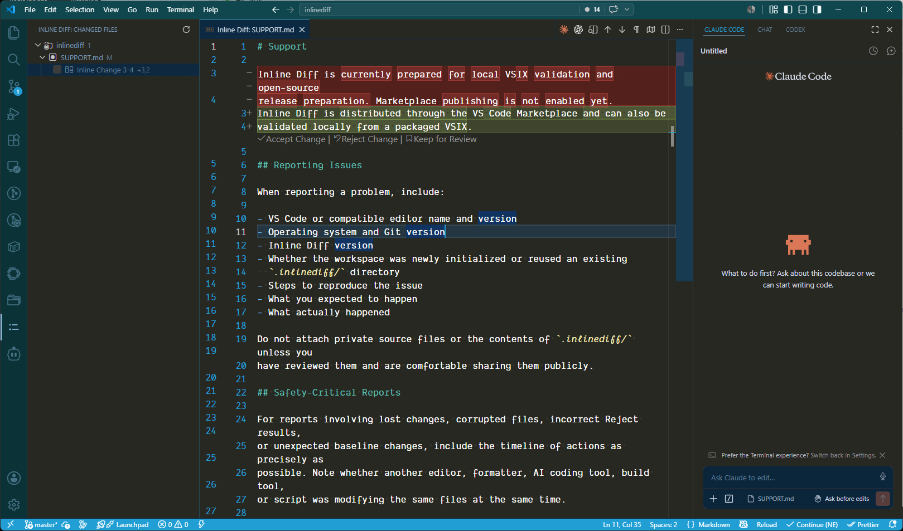

<div align="center">


# Inline Diff

**Review AI and tool-generated edits change by change before they reach Git.**

[](#license)
[](https://code.visualstudio.com/)
[](#status)
[](#contributing)

[한국어](https://github.com/freeslur/inlinediff/blob/main/README.ko.md)



</div>

---

You point an AI agent at your project and step away. You come back to twenty changed
files. Some of it is exactly what you asked for. Some of it is subtly, quietly wrong.
Now you have to separate the keepers from the mistakes — without turning your Git
history into a graveyard of `wip`, `fix`, and `actually fix this time`.

That sorting step is the whole reason Inline Diff exists.

It keeps a private *accepted baseline* of your project, completely separate from Git,
and shows you everything that has changed since the last time you said "yes." You keep
the good parts, throw out the bad ones, and set aside the ones you're still unsure
about — all at the individual-change level, right inside the editor you already use.
Git does not get involved until after you've made up your mind.

> Git records what you decided. Inline Diff is where you decide.

And it doesn't care which tool made the change. Claude Code, Codex, a Prettier pass,
a one-off shell script — if it touched your files, Inline Diff surfaces it the same
way. That's the gap your assistant's built-in "accept / reject" leaves open: it only
ever knows about its *own* edits, and only while it's running.

## How it works

Inline Diff stores your last accepted state in its own repository, tucked away inside
`.inlinediff/`. It never touches your real Git repository — your index, your HEAD, your
stashes, and your config all stay exactly as you left them.

From there the loop is simple:

- **Scan** — Inline Diff compares your working files against the accepted baseline and
  lists what changed.
- **Open** — Click a file to see it in VS Code's inline diff, against the actual file
  on disk.
- **Decide** — Accept or reject a whole file, or go change by change with the CodeLens
  actions on each hunk.
- **Defer** — Not sure about a change? Mark it **Keep for Review**, accept everything
  else in one go, and come back to just the parts that still need a human.

Accepting a change rolls the baseline forward. Rejecting one writes the baseline
content back over that part of the file. Either way, your Git staging area stays free
for shaping commits *after* the review is done — not as a scratchpad *during* it.

## Features

- A tree view of everything that changed: added, modified, deleted, and binary files
- Inline diffs opened against the real project file, not a throwaway copy
- Accept / Reject at the file level **and** the individual-change level
- **Keep for Review** to park uncertain changes and bulk-accept the rest
- A baseline that's fully isolated from your Git repository, index, and settings
- Encoding-aware text handling, with binary files kept out of the text diff path
- Lazy hunk computation, so large change sets stay responsive
- Change actions that hide themselves while a file is mid-edit or has unsaved changes

## Requirements

- **VS Code 1.80** or newer.
- **Git 2.32** or newer, available on your `PATH`. Inline Diff shells out to Git to keep
  its baseline, and relies on `GIT_CONFIG_GLOBAL` (added in Git 2.32) to stay isolated
  from your global Git configuration.

## Getting started

Install **Inline Diff** from the VS Code Marketplace: open the Extensions view
(`Ctrl+Shift+X`), search for _Inline Diff_, and click **Install**.

Prefer to build from source? Build and install the VSIX locally:

```powershell
pwsh ./scripts/build.ps1 -Task Install
pwsh ./scripts/build.ps1 -Task Package   # → dist/inlinediff-0.1.2.vsix
code --install-extension dist/inlinediff-0.1.2.vsix
```

Then open a workspace, open the **Inline Diff** view in the Activity Bar, and click
**Initialize Project** — the **+** button in the view's title bar (or run
`Inline Diff: Initialize Project` from the Command Palette). Edit some files, and review
the changes right there in the view.

A couple of things worth knowing:

- Add a `.diffignore` at the project root to hide generated files or local-only paths
  from review. It's separate from `.gitignore` — it controls only what Inline Diff tracks
  and never affects Git. Already-accepted files stay safe even if you change the ignore
  rules later.
- Text files larger than 2 MiB are excluded from diff tracking. Binary files are tracked by path only.
- Inline Diff needs `diffEditor.codeLens: true` and `diffEditor.renderSideBySide: false` to
  display inline diffs. It writes these to your workspace settings at Initialize time, and
  again if you open a diff when the settings don't match and confirm the change. Your
  previous settings are backed up first. These settings affect **every** diff editor in VS
  Code — Git's diff and other extensions' diffs too, not just Inline Diff's. Run
  `Inline Diff: Restore Diff Settings` from the Command Palette to return to your previous
  settings.

## Multiple projects

A project is a **workspace folder that has a `.inlinediff` at its root** — nothing else.
Open several folders at once (a multi-root workspace) and each one that carries a
`.inlinediff` appears as its own independent project. They never coordinate:

- **Each project reviews from its own baseline**, set when you initialized it, with its
  own `.diffignore` (only the one at its root) and its own Accept/Reject. A decision in
  one project never touches another.
- **Inline Diff never searches inside a project for more stores.** A `.inlinediff` that
  sits deeper in the tree — say, a folder you copied in that already carried its own — is
  just ignored data: the outer project tracks its source files like any other file, but
  not its `.inlinediff/` internals. That folder becomes a project of its own only when you
  open *it* directly as a workspace root.

## Why not just use Git?

Because Git is good at the wrong half of this problem — on purpose.

Git's whole value is a clean, intentional history of decisions you've already made.
Almost nobody commits every failed experiment, every debug line, every "let me try it
this other way" along the road to working code; and the people who do tend to squash
it all away before anyone sees it. That messy middle — the part where you're still
figuring out which version is right — just evaporates.

Inline Diff is built to live in that middle. It's not trying to be a better `git diff`,
and it's not a replacement for Git. Git keeps doing what it's great at: recording the
code you've committed to. Inline Diff handles everything *before* that point — the
deciding, the undoing, the "keep this, drop that" — so none of it has to leak into your
history.

## Roadmap

A direction, not a promise: grow the deciding step — accepting and rejecting AI-written
changes — into something durable, with small reviewable units and decisions you can
revisit.

- **Layered review** — split a file's change history into read-only intermediate
  snapshots, to see *when* working code started to break.
- **Inline stashing** — set a specific change aside, take it out of the file, and bring
  it back later.
- **Named checkpoints & decision history** — mark a baseline and look back at what was
  accepted or rejected against it.
- **Reasons behind rejections** — capture *why* a change was rejected, so it guides the
  next change instead of being thrown away.
- **Agent-facing CLI, TUI & MCP** — drive review from terminals and expose the trail to
  external coding agents, not just the editor.
- **Team review & PR evidence** — share the same baseline and checkpoints across people
  and agents, and bundle the review trail into PRs.

## Safety

Reject writes baseline content back over the selected part of a file. If another
editor, formatter, build tool, or script is changing that same file at the same moment,
those outside changes can be overwritten while the reject is applied.

**Only reject when nothing else is actively writing to the target file.**

## Status

Inline Diff is at `0.1.2` — an early release. The core review loop — scan, open,
accept, reject, and keep-for-review — is stable and covered by tests. The items under
[Roadmap](#roadmap) are still ahead. Bug reports and feedback are welcome.

## Contributing

Issues and pull requests are welcome. The standard checks before sending a change:

```powershell
pwsh ./scripts/build.ps1 -Task Check        # typecheck, lint, test, build
pwsh ./scripts/build.ps1 -Task ReleaseCheck # the local release packaging gate
```

The project is TypeScript on Bun, formatted and linted with Biome, and developed
test-first.

## License

Dual-licensed under the MIT License and the Apache License, Version 2.0. Use whichever
fits your project. See [`LICENSE`](LICENSE), [`LICENSE-MIT`](LICENSE-MIT), and
[`LICENSE-APACHE`](LICENSE-APACHE).
